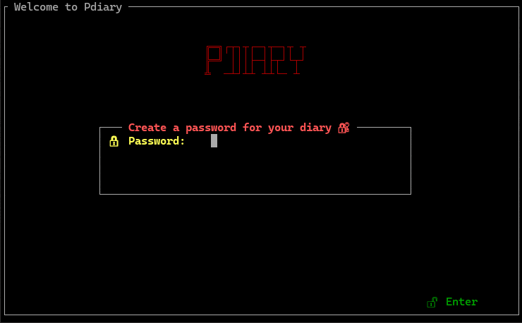

<h1 align="center">pdiary</h1>

A simple  terminal-based diary journal application written in Python.
 

</a>

## Installation

#### Requirements
- [Python 3.3+](https://www.python.org/downloads/)
- [npyscreen](https://pypi.python.org/pypi/npyscreen)
- [peewee](https://github.com/coleifer/peewee)
- [pysqlcipher3](https://pypi.org/project/pysqlcipher3/)

To install, simply use `pip`:

    pip install pdiary

## Usage
It is recommended to run pdiary in a terminal that's support 256 colors, resize and UTF-8.

To run pdiary open a terminal and type:

    pdiary 

The interaction of the software is made through the keyboard arrow keys and also the TAB key. Enter key is used for select and confirm.
If your terminal supports mouse interaction you also can control the widgets with the mouse.

## Known Issues

- In some old terminals without support to new technologies, it can be possible to happen some errors like the non exhibition of some icons and some characters, it can also have some trouble with colors.
- Pdiary is responsive, positioning is done according to terminal sizes, but sometimes it might break. If so, try in a terminal with a different size.

## Contributions

- Pull requests are awesome and always welcome. Please use the [issue tracker](https://github.com/manipuladordedados/pdiary/issues) to report any bugs or file feature requests.